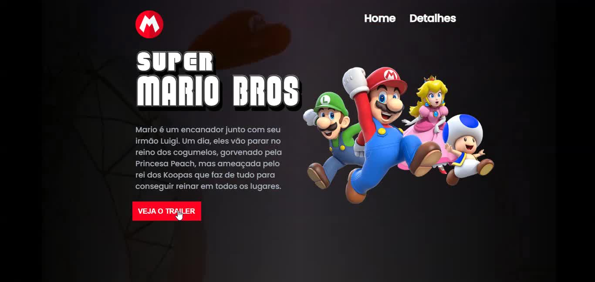

<h1 align="center">Site Super Mario Bros 🧑🏻‍🔧 </h1>
 

  

 
 

    Projeto bem legal do Super Mario Bros - O filme.
    Projetos simples, mas que me trouxe mais consolidação sobre o Front-End 🚀

## 🚀 Tecnologias

Esse projeto foi desenvolvido com as seguintes tecnologias:

- HTML e CSS
- JavaScript
- Git e Github

- [Acesse o projeto finalizado, online](https://projeto-site-mario-bros-pi8e.vercel.app/)

## :memo: Licença

Esse projeto está sob a licença MIT.

---
